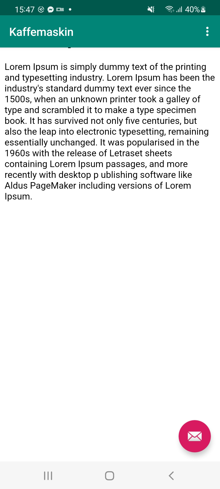

# Rapport

### Ändringar!

1. Ändrade namn på appen.

``
<resources>
<string name="app_name">Kaffemaskin</string>
<string name="action_external_web">External Web Page</string>
<string name="action_internal_web">Internal Web Page</string>
</resources>
``

2. Gav tillåtelse att visitera externa webbplatser.

``
<uses-permission android:name="android.permission.INTERNET" />
``

3. Instanserade WebView objekt som privat-medlem hos 'MainActivity'

``
    private WebView webView;
``

3.1 Implementerar 'webview' hos 'onCreate' metoden

``
@Override
protected void onCreate(Bundle savedInstanceState) {
super.onCreate(savedInstanceState);
setContentView(R.layout.activity_main);
Toolbar toolbar = findViewById(R.id.toolbar);
setSupportActionBar(toolbar);

        this.webView = findViewById(R.id.webView);

        WebSettings webSettings = this.webView.getSettings();
        webSettings.setJavaScriptEnabled(true);

        FloatingActionButton fab = findViewById(R.id.fab);
        fab.setOnClickListener(new View.OnClickListener() {
            @Override
            public void onClick(View view) {
                Snackbar.make(view, "Replace with your own action", Snackbar.LENGTH_LONG)
                        .setAction("Action", null).show();
            }
        });
    }
``

4. Lade till en 'assets' folder samt en html fil 'index.html'

5. Implementerade metoderna showExternalWebpage och showInternalWebpage med hjälp av webview objektet.

``
    public void showExternalWebPage(){
        this.webView.loadUrl("https://his.se");
    }
    
    public void showInternalWebPage(){
        this.webView.loadUrl("file:///android_asset/index.html");
    }
``

6. Implementerade in showExternalWebpage och showInternalWebpage in till respektive event-kallning.

``
    //noinspection SimplifiableIfStatement
    if (id == R.id.action_external_web) {
        this.showExternalWebPage();
        return true;
    }
    if (id == R.id.action_internal_web) {
        this.showInternalWebPage();
        return true;
    }
``

